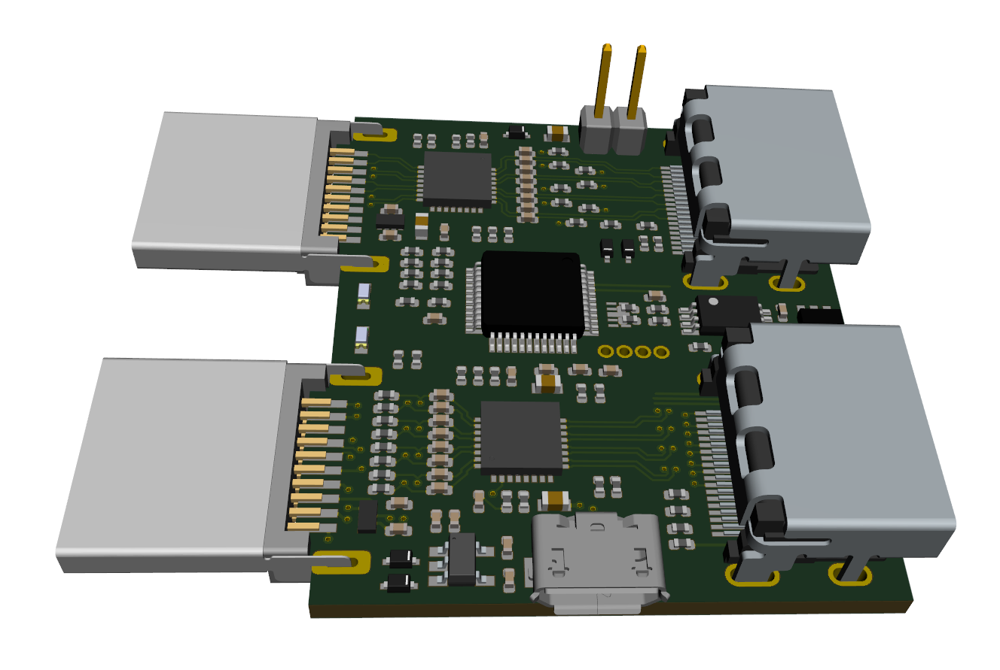

Video Booster Board
===================

This repository contains a KiCad PCB project for Video Booster Board.
The board utilizes a pair of PTN3363 HDMI signal boosters to improve signal quality transmitted over long HDMI cables.
Booster configuration and HDMI control signals are managed by EFM32 microcontroller.

|

Video Booster Board data flow diagram:

.. image:: ./Images/vsb-data-flow.svg

|

Board visualization:

Getting Started
---------------
By default EFM32 microcontroller has SiLabs AN0042. To make the MCU compatible with Video Booster Board firmware it is necessary to flash it with [Toboot](https://github.com/im-tomu/toboot) using Openocd.
To flash Toboot follow this [instruction](https://github.com/im-tomu/toboot/tree/master/openocd). Be aware that it was originally created for Tomu board, so wiring differs a little bit. SWD pins are located on the bottom side of Video Booster Board. Connect all 4 signals accordingly. 

