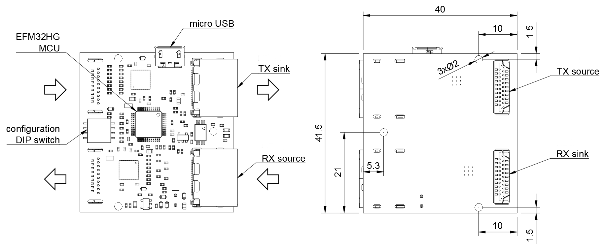
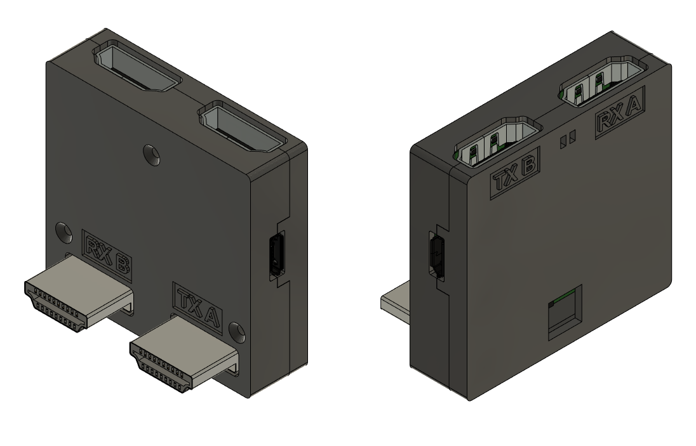
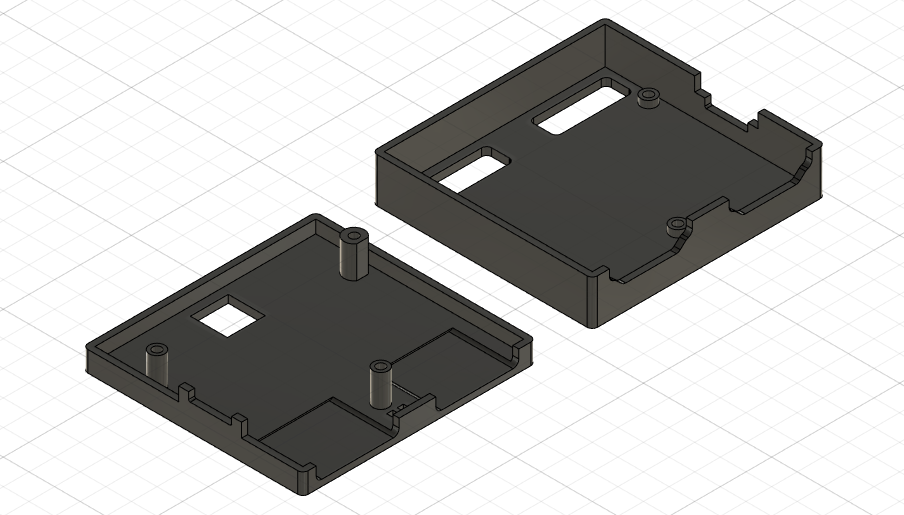

===================
Video Booster Board
===================

Copyright (c) 2019-2021 `Antmicro <https://www.antmicro.com>`_

.. image:: ./img/vsb-board.png

Overview:
=========

This repository contains a KiCad PCB project for an open hardware board design that allows to improve the quality of HDMI video signals transmitted over long cables.

Key features:
=============

* HDMI signal preconditioning with a pair of `PTN3363 <https://www.nxp.com/docs/en/data-sheet/PTN3363.pdf>`_ HDMI level shifters.
* Signal equalization controlled with on-board DIP-Switch
* On-board SiLabs `EFM32HG322F64 <https://www.silabs.com/documents/public/data-sheets/efm32hg-datasheet.pdf>`_ MCU for interactive control and board monitoring
* Supports different EDID connection scenarios

Mechanical layout and dimensions
================================

The board has been mechanically optimised for usage with the `Numato Opsis <https://hdmi2usb.tv/numato-opsis/>`_ open video capture device.
It is possible to use it with different platforms using HDMI extender cables.

It follows the data flow diagram presented below:

.. image:: ./img/vsb-data-flow.svg

Getting Started
===============

Please refer to KiCad schematic files for more information regarding hardware functionalities implemented in the design.
The PCB layout has been defined with a 4-layer stackup.
Please check the geometry of differential traces implemented in the design with stackup offered by PCB vendor for optimal impedance match of HDMI traces.
There is a BOM document generated from the schematics and shared in this repository.
Please short the ``J5,J7,J8,J12`` solder jumpers on the bottom side of the PCB.
This will relay the EDID signals on both HDMI channels from input to output.
Short the ``J11,J4`` jumpers if you plan to experiment with the provided example MCU firmware.
This will make the on-board MCU accessible on EDID bus driven from ``J2`` HDMI input connector.
Please check the schematics and software codebase for any other jumper configuration.

Example firmware
================

The EFM32 MCU used in the design comes with a factory programmed ``AN0042`` bootloader.
In order to  make the MCU compatible with the provided example firmware it is advisable to replace the default bootloader with `Toboot <https://github.com/im-tomu/toboot>`_
over SWD interface using `OpenOCD <http://openocd.org/>`_.
The SWD signals from the MCU are exposed on test pads marked with ``IO`` and ``CLK`` on the bottom side of the Video Booster Board.
Additionally there are test pads with system ground and power supply exposed next to them.

To upload the ``Toboot`` bootloader, please follow this `instruction <https://github.com/im-tomu/toboot/tree/master/openocd>`_.
Be aware that the provided flashing instruction was originally created for a different hardware platform so the SWD connection wiring differs a little.

There is an ``example-firmware`` folder included in this repository, which contains a sample firmware driven by the RTOS derived from the `Zephyr project <https://www.zephyrproject.org/>`_.
The firmware makes the on-board EFM32 MCU act as an EDID slave for the transmitting device.

In order to build the example firmware please use the following commands::

     git clone https://github.com/antmicro/video-signal-booster-board
     cd video-signal-booster-board
     git submodule update --init --recursive
     cd example-firmware
     python3 -m pip install -r zephyr/scripts/requirements.txt
     wget https://github.com/zephyrproject-rtos/sdk-ng/releases/download/v0.10.3/zephyr-sdk-0.10.3-setup.run
     chmod +x zephyr-sdk-0.10.3-setup.run
     ./zephyr-sdk-0.10.3-setup.run -- -d <zephyr_installation_path>
     export ZEPHYR_TOOLCHAIN_VARIANT=zephyr
     export ZEPHYR_SDK_INSTALL_DIR=<zephyr_installation_path>
     source zephyr/zephyr-env.sh
     west init -l zephyr
     west update
     make

Once the firmware is compiled, connect the micro USB cable to the Video Booster Board and upload the firmware using the following command::

     dfu-util -d 1209:70b1 -D build/zephyr/zephyr.bin

Please note that in this setup the firmware doesn't stick permanently. After a power cycle a bootloader will start again. This simplifies the developing process.

The example firmware makes the MCU on Video Booster Board accessible on I2C/EDID bus slave device under the address of ``0x3a`` (7-bit notation).
It's possible to test the I2C/EDID communication by connecting an I2C master device to TX source HDMI connector (``J2``).
The example firmware makes MCU offer a single 8-bit configuration register.
Two least significant bits of this register control the states of the ``TX_EQ0`` and ``TX_EQ1`` signals that define the equalization settings of ``U3`` HDMI level shifter.
The states of those signals are also displayed on ``D8`` ``D9`` LEDs installed on board.

A sample Python code that would drive the MCU over I2C bus is::

     python
     import smbus
     bus = smbus.SMBus(<i2c_bus_number>)
     bus.write_byte_data(0x3a, 0x00, 0x03)

3D-printable enclosure
======================

There are also 3D-printable enclosure .stl files available in the ``3d-models`` directory.
The enclosure allows the electronics to be covered and attaches the Video Booster Board to the Numato board installed in a typical thin mini-ITX chassis.
A connector is the source, B is the sink of the RX/TX signal. 

For printing the enclosure, use slicer settings matching your used 3D printer and filament.
Setting layer thickness to a value between 0.15mm and 0.2mm is sufficient.
The image below shows proposed print orientation.

Enclosure can be assembled with the board using 3 M1.6x8 flathead bolts.

License
=======

`Apache-2.0 <LICENSE>`_
